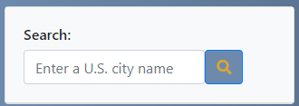
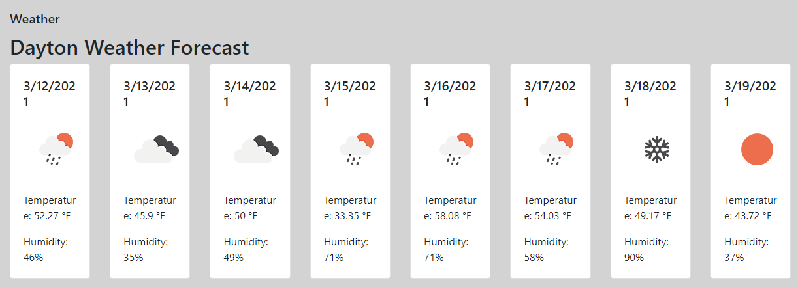
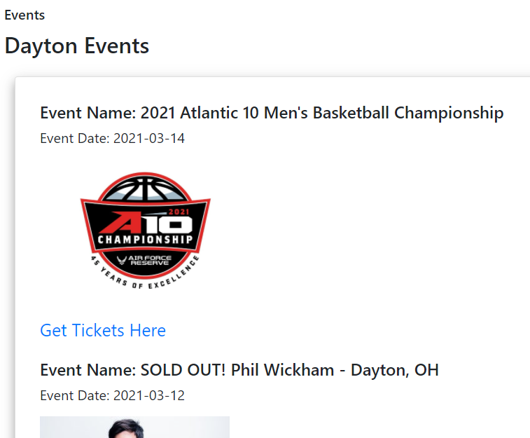
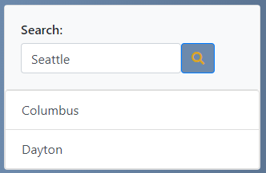
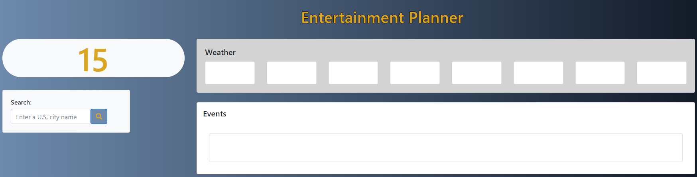
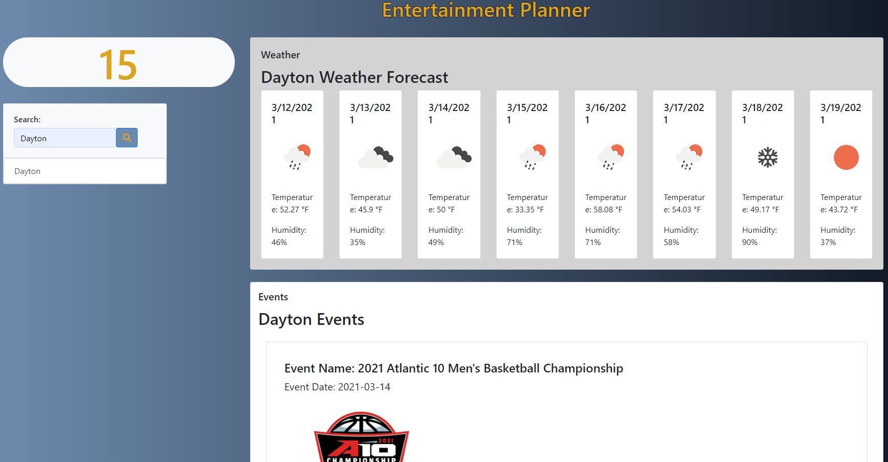

# Entertainment Planner

https://bdcii.github.io/TripPlan/

## Description

This is an application designed to help users plan for a week of entertainment.  The goal when creating the application was to allow a user to look at the following 8 days and decide what they would like to do based on the weather and the events were happening in that city. 

## Features

WHEN the user enters a city name and clicks the search button,

 

THEN the following items are displayed for the current date and the following 7 days: weather forecast and entertainment events.

- Weather display includes the date, temperature and humidity for each of the 8 days.
 

- Entertainment events display includes the name, date and a link to purchase tickets to the event.  WHEN the user clicks the "Get Tickets Here" link, THEN a new tab is opened to the TicketMaster website where tickets for that event are sold.
 

WHEN the user performs a search for a different city, THEN previous searches will be available in a list underneath the search field.
 

This list allows the user to click on their recently searched cities to again display the coordinating weather and entertainment associated with that city.

This screenshot shows the page when it originally loads:
 

This screenshot shows the page when a city is chosen:
 

## Future Developments

In the future we would like to add the following features:

- Flight information for travel booking

- Hotels for booking accomodations 

- Restuarant information for additional leisure activities

- Update to make mobile experience even more user friendly